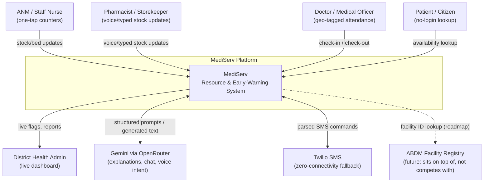
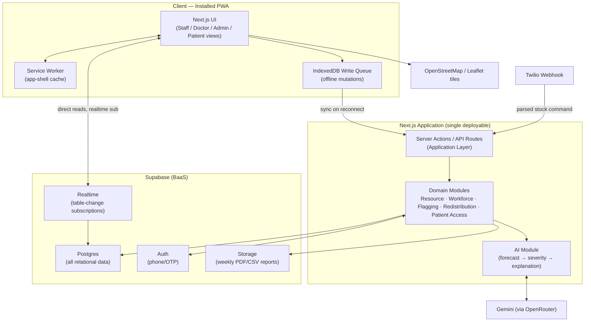
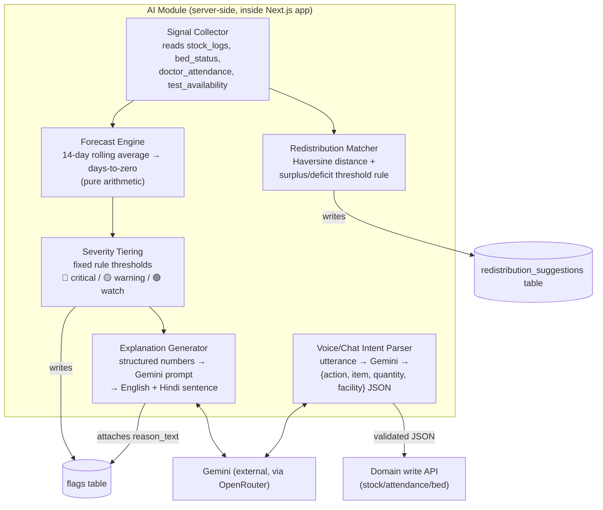
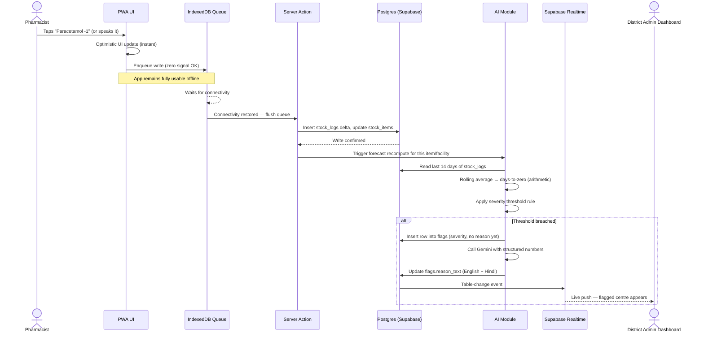
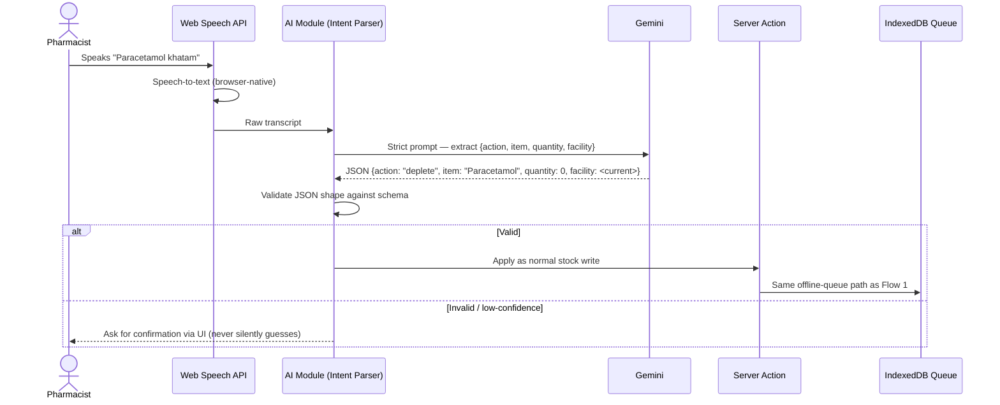
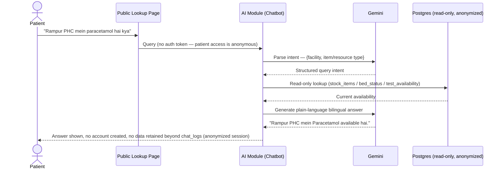
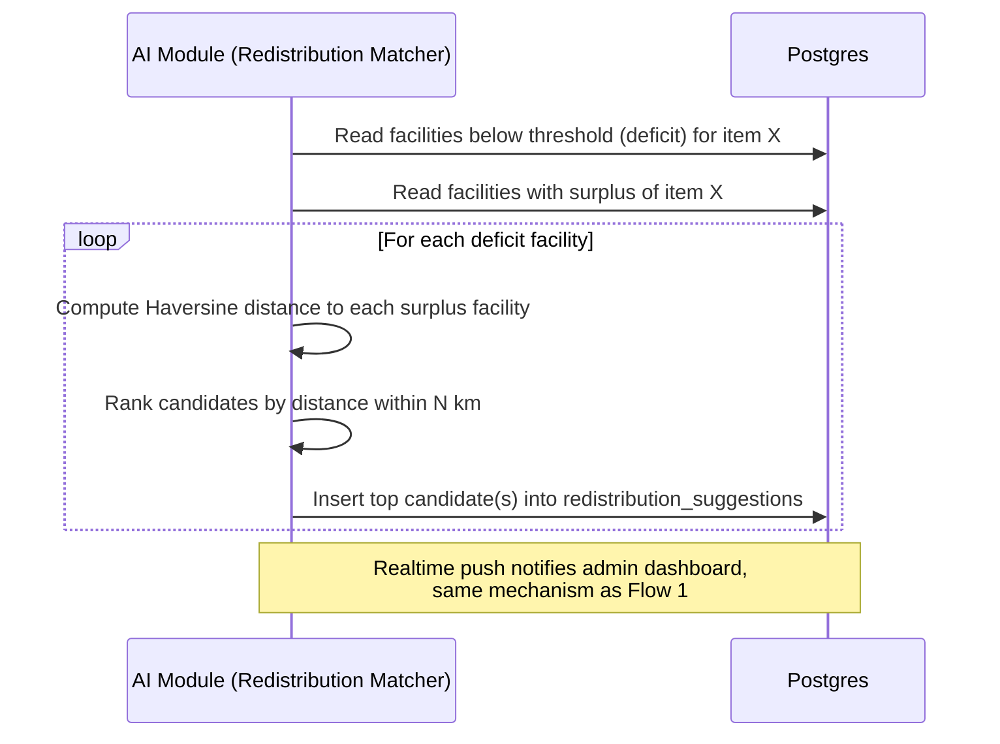

# Design.md - Mediserv Architecture

## 1. Executive Summary

MediServ is a district-scale, offline-first resource and early-warning platform for Primary Health Centres (PHCs) and Community Health Centres (CHCs). It turns stock levels, bed occupancy, doctor attendance, and equipment status — currently tracked on paper and discovered too late — into live, AI-explained signals a district admin can act on before a patient is turned away. The architecture is a deliberately small surface area: a single Next.js PWA, a single Supabase backend, and a thin AI layer that explains numbers rather than inventing them. Every architectural choice in this document answers to one test, restated from the source brief: does this help a nurse, pharmacist, doctor, patient, or district admin do their job today, or is it here because templates usually have it.

**Key architectural principles:**
- **Offline-first is a hard constraint, not a feature.** The write path never depends on live connectivity.
- **Minimize infrastructure, maximize managed services.** One BaaS (Supabase) replaces four subsystems.
- **AI explains; arithmetic decides.** Forecasting and severity are deterministic and auditable; the LLM's job is translation into plain, bilingual language.
- **Model only the healthcare complexity that PHCs/CHCs actually have.** No EHR, no bed sub-taxonomies nobody will fill in.
- **Sit on top of government infrastructure, don't duplicate it.** ABDM/HMIS/eSanjeevani are neighbors, not competitors.

---

## 2. System Overview

### Purpose
Surface operational problems at PHCs/CHCs — stock-outs, unreported bed shortages, doctor absenteeism, broken equipment — early enough for a district admin to act, and make that information directly queryable by patients before they travel.

### Core Capabilities
- One-tap/voice data capture for stock, beds, and attendance, usable offline.
- Deterministic forecasting and rule-based severity tiering on that data.
- AI-generated, bilingual (English/Hindi), one-line explanations for every flag.
- Distance-based redistribution suggestions between nearby facilities.
- No-login public lookup and chatbot for patients.
- Live, real-time district admin dashboard with auto-generated weekly reports.

### Stakeholders
ANM/Staff Nurses, Pharmacists/Storekeepers, Doctors/Medical Officers, Patients/Citizens, District Health Admins, and — as a first-class internal actor — the AI layer that turns raw logs into forecasts, flags, and plain-language explanations.

### Key Quality Attributes (priority order)
1. **Offline usability** — the system must be fully operable with zero signal.
2. **Time-to-action for critical flags** — data entry to visible, explained flag should be near-instant once connectivity exists.
3. **Low-friction data entry** — every core action under five seconds; voice and regional language as first-class input.
4. **Auditability** — every AI-influenced number must be traceable to a deterministic calculation.
5. **Operational simplicity** — minimal infrastructure to run and debug, given a small team.
6. **Data-access integrity** — a facility's staff can only affect their own facility's data.

---

## 3. Architectural Style & Core Principles

MediServ is a **modular monolith** (Next.js App Router, API Routes/Server Actions) built against a **managed backend-as-a-service** (Supabase), organized internally along **Domain-Driven Design** module boundaries, with an **offline-first, event-driven synchronization layer** at the edge and a **deterministic-then-generative** AI pipeline.

This combination fits a district-scale medical resource platform specifically because:

- **A monolith matches the actual load profile.** Hundreds of facilities generating occasional writes is not a scaling problem; it's a *reliability-in-the-field* problem. Spending complexity budget on microservice decomposition would trade away time that needs to go into the offline queue and AI-explanation pipeline instead.
- **DDD-style internal module boundaries** (Resource Monitoring, Workforce/Attendance, Flagging & Analytics, Redistribution, Patient Access) keep the domain concepts a nurse or district admin would recognize as the organizing structure of the code — not generic CRUD-around-tables — so a future service extraction, if ever warranted, follows real seams rather than needing rediscovery.
- **Offline-first, event-driven sync at the edge** is the architecture's central adaptation to its actual deployment environment. Most healthcare SaaS architecture patterns assume reliable connectivity; MediServ inverts that assumption because the alternative is staff reverting to the paper register the system is meant to replace.
- **Deterministic-then-generative AI** keeps the parts of the system that determine severity fully auditable and independent of a third-party LLM's availability, while still giving the district admin genuinely readable, bilingual output — which is what makes the dashboard usable in three seconds instead of requiring chart literacy.

---

## 4. C4 Model

### Context Diagram

### Container Diagram

### Component Diagram — AI Module (key component, since Section 7 of the brief calls this out as crucial)

---

## 5. Detailed Architecture Breakdown

### Presentation Layer
Next.js App Router pages/components styled with Tailwind, split by persona surface: Staff Data-Entry, Doctor Attendance, District Admin Dashboard, and the no-login Patient Lookup page. All write-triggering components call Server Actions directly — there is no separate client-side API-fetch layer to keep in sync with backend routes. The PWA shell (via `next-pwa`) and service worker live here, making "installable, opens with zero signal" a presentation-layer guarantee, not something bolted on later.

### Application Layer
Server Actions and a small number of API Routes (the latter reserved for cases needing a stable HTTP contract, such as the Twilio SMS webhook) act as use-case orchestrators: validate input, check the caller's role/facility scope, invoke the relevant domain module, and return an optimistic-update-friendly result. This layer intentionally contains no business rules of its own — those live in the domain modules — so it stays thin and easy to reason about during a live demo or an incident.

### Domain Layer (core of the system)
Organized into five bounded contexts, matching the personas and modules in Sections 3 and 6 of the brief:

- **Resource Monitoring** — stock items/logs, bed status, test/equipment availability. Owns the "what does a facility currently have" question.
- **Workforce** — doctor attendance, geo-tagged check-in/out. Owns the "who is actually present" question.
- **Flagging & Analytics** — forecast engine, severity tiering, the `flags` table lifecycle (created → explained → resolved). This is the busiest context and the one the AI module attaches to.
- **Redistribution** — Haversine matching between surplus and deficit facilities; owns `redistribution_suggestions`.
- **Patient Access** — the no-login lookup and chatbot; deliberately has read-only, anonymized access into Resource Monitoring data and no write capability at all.

Each context owns its tables and exposes a narrow function-level API to the Application Layer — the internal seam that would become a service boundary if ADR-001's monolith decision is ever revisited.

### Infrastructure Layer
Supabase client wrappers (Postgres access, Auth, Realtime subscriptions, Storage), the Gemini/OpenRouter client used by the AI module, the Twilio webhook handler, and the IndexedDB/service-worker sync machinery all live here — isolated behind the domain layer's interfaces so that, for example, swapping the LLM provider (ADR-006's stated exit path) touches only this layer.

### Cross-Cutting Concerns
- **Auth & Authorization:** Supabase Auth (phone/OTP) plus Postgres Row Level Security, applied uniformly regardless of which domain module is being written to.
- **Internationalization:** English/Hindi is threaded through the presentation layer (UI strings) and the AI module (generated explanations and chat) as a single concern, not duplicated logic in two places.
- **Offline Sync:** the IndexedDB queue and background sync process is a cross-cutting concern from the client's point of view — every write-capable domain module's client call goes through the same queue-then-sync path.
- **Audit Trail:** `stock_logs` as an append-only delta log (not just current-state tables) is a deliberate cross-cutting logging concern, giving every domain a trace of what happened even under last-write-wins conflict resolution.

---

## 6. Data Flow & Sequence (Critical Flows)

### Flow 1 — Offline-First Stock Update, Sync, and Flag Creation

### Flow 2 — Voice Input to Stock Update (Hindi)

### Flow 3 — Patient No-Login Lookup / Chatbot

### Flow 4 — Redistribution Suggestion Generation

---

## 7. AI Architecture Integration

The AI layer is deliberately structured as a **three-stage pipeline**, and the boundary between stages is the single most important design decision in the AI architecture:

**Stage 1 — Signal Collection (deterministic, no AI).** Raw writes from staff (stock deltas, bed toggles, check-ins) land in Postgres exactly as entered. No AI touches this stage; it is pure data capture.

**Stage 2 — Deterministic Compute (arithmetic and rules, no AI).** The Forecast Engine, Severity Tiering, and Redistribution Matcher operate entirely on arithmetic (rolling averages, fixed thresholds, Haversine distance) against Stage 1 data. This stage produces the actual decision — *is this a flag, and how severe* — and it is fully independent of any third-party AI service being available, fast, or correct. This independence is intentional: a patient-safety-adjacent flag must never fail to fire because an LLM call timed out.

**Stage 3 — Generative Layer (Gemini via OpenRouter).** Only once Stage 2 has produced a number and a tier does the LLM get involved, and its role is narrowly scoped to three tasks:
1. **Explanation generation** — turning `{item: Paracetamol, days_to_zero: 3, facility: Rampur PHC}` into a one-line English + Hindi sentence a district admin can read in three seconds.
2. **Voice/chat intent parsing** — turning a spoken or typed utterance (including Hindi-English code-switching) into a strict `{action, item, quantity, facility}` JSON payload, which is schema-validated before being allowed anywhere near a write path.
3. **Patient chatbot responses** — read-only, anonymized queries against current availability data, translated into a natural bilingual answer.

**Why this staging matters architecturally:**
- **Failure isolation.** A Gemini outage degrades to "flag exists with raw numbers, no friendly sentence yet" — never to "flag doesn't exist." The system's core safety function survives the AI provider being down.
- **Auditability.** Every severity tier and forecast number traces back to a documented arithmetic rule (see ADR-005), which is what makes the system defensible to a skeptical district admin or auditor asking "why does it say critical."
- **Provider substitutability.** Because generative calls are isolated to Stage 3 behind a single AI-module interface, swapping Gemini for another model (per ADR-006's stated exit path) touches one layer, not the forecasting or flagging logic.
- **Input validation as a safety boundary.** Voice/chat-derived JSON is never trusted directly into a write path — it's validated against the same schema and RLS boundary as any manually typed input, so a misheard or hallucinated intent can't corrupt facility data; low-confidence extractions are surfaced back to the user for confirmation rather than silently applied.

---

## 8. Technology Stack & Justifications

| Layer | Choice | Justification |
|---|---|---|
| Frontend | Next.js (App Router) + Tailwind, PWA via `next-pwa` | Single deployable, installable on Android home screens with no app-store friction; Server Actions give type-safe client-to-server calls without a second backend app |
| Offline queue | IndexedDB (`idb`/Dexie.js) + Service Worker | Only viable way to guarantee zero-signal usability in-browser; avoids native app install friction |
| Backend | Next.js API Routes / Server Actions | No separate backend to deploy, version, or debug live; matches ADR-001's modular-monolith decision |
| Database + Auth + Realtime + Storage | Supabase (free tier) | Collapses four subsystems into one managed service; Postgres gives real relational integrity for facility/stock/flag joins; RLS enforces facility-scoped access at the data layer |
| AI | Gemini via OpenRouter (free tier) | Strong multilingual (Hindi) generation at zero marginal cost during build/pilot; narrow task scope (templated explanation, structured extraction) doesn't need frontier-model reasoning |
| Maps | OpenStreetMap + Leaflet | Zero API-key friction, zero cost, sufficient for facility-location plotting and proximity visualization — no routing features needed |
| SMS fallback | Twilio (trial, or mocked for demo) | Closes the true zero-data-signal gap the PWA's offline queue can't address on its own; demonstrates design awareness without requiring a production telecom contract |
| Voice input | Web Speech API (browser) → Gemini | Native browser support, zero extra infrastructure; keeps voice as a first-class input path per Design Principle #3 |
| Hosting | Vercel | Free tier, instant deploys, matches Next.js natively, reliable for a live judged demo |

---

## 9. Non-Functional Requirements & How They Are Addressed

### Scalability
The Next.js app is stateless per request and scales horizontally on Vercel without code changes. Supabase's connection pooling handles the district-scale write/read volume (hundreds of facilities, thousands of daily writes) comfortably within free/low-tier limits. The domain-module boundaries described in Section 5 give a clear extraction path — most likely the AI module first, since Gemini calls are the highest-latency operation in the system — if a future multi-district rollout produces load the monolith can't comfortably absorb.

### Security & Compliance
MediServ's deployment context is Indian district-level PHC/CHC infrastructure, so the operative compliance framework is **India's Digital Personal Data Protection (DPDP) Act, 2023**, IT Rules around reasonable security practices, and alignment with **ABDM's** data-sharing and consent conventions — not HIPAA (a US statute) or GDPR (an EU regulation), neither of which applies by jurisdiction here, though the same underlying principles (data minimization, purpose limitation, access control, auditability) are good practice regardless of which law technically governs.

The architecture is built to minimize compliance surface rather than manage a large one after the fact:
- **No patient-identifiable medical record exists in the system at all** (ADR-010) — `footfall_logs` is an anonymous daily counter, and patient lookup requires no login (ADR-008), so there is no personal health data to protect because none is collected.
- **Row Level Security enforces facility-scoped access** (ADR-007) at the database layer, so a role-check bug in application code can't become a data-access incident — a control any district-level auditor or MeitY-aligned security review would specifically look for.
- **`stock_logs` as an append-only audit trail** means every state change is traceable to who made it and when, independent of the last-write-wins conflict handling used for the current-state tables.
- **ABDM alignment is a forward-compatible design choice, not a current dependency** — the `facilities` table already reserves an ABDM facility ID column, so future consent-based data-sharing with ABDM's registry is additive, not a retrofit.

### Observability
Vercel's built-in request/function logs and Supabase's Postgres/Auth/Realtime logs cover the current operational visibility need at this scale. The `flags` and `stock_logs` tables double as a lightweight, queryable audit trail beyond generic application logs — a district admin can already answer "what happened and when" from the domain data itself, without a separate observability stack. A dedicated error-tracking tool (e.g., Sentry) is the natural next addition once the system moves from demo/pilot to a supported deployment.

### Performance
Offline-first design (Section 6, Flow 1) removes network latency from the interaction the user actually feels — the five-second one-tap action completes optimistically regardless of backend round-trip time. Forecast and severity computation is O(n) arithmetic over a bounded 14-day window, negligible cost per facility per item. Supabase Realtime avoids the wasted-request overhead of polling for dashboard updates.

### Maintainability
Domain-module boundaries (Section 5) keep business logic organized by concept a domain expert would recognize, not by generic CRUD structure. The flat, binary data models (ADR-010) minimize migration risk as the system evolves. The ADR log itself (`DECISIONS.md`) is a maintainability artifact: it records not just what was built but why alternatives were rejected, so a future contributor doesn't re-litigate settled trade-offs (e.g., "why isn't this microservices") without the original context.

---

## 10. Architecture Evolution & Roadmap

The v1 architecture is deliberately scoped to what a hackathon build and first pilot need, with explicit seams left open for what comes next:

- **ABDM registry integration** — the `facilities.abdm_facility_id` column is already reserved; the next step is consent-based read integration against ABDM's registry, keeping MediServ positioned as a layer on top of, not a competitor to, that infrastructure (Section 13 of the source architecture).
- **Production-grade SMS gateway** — moving from a mocked/trial Twilio webhook (ADR-009) to a paid, format-tolerant SMS parsing service before any zero-data-signal district pilot.
- **Trained forecasting model** — once 3–6 months of real multi-facility `stock_logs` data accumulates, the deterministic rolling-average forecast (ADR-005) can be supplemented by a proper seasonal/trend model, with the LLM's role staying unchanged (explanation only) to preserve auditability.
- **Citizen accounts and proactive notification** — an opt-in extension of the currently login-free patient experience (ADR-008), for use cases like "notify me when Paracetamol is back in stock at Rampur PHC" — added without making the base lookup require login.
- **Ambulance/SOS routing** — explicitly roadmap-only in the source scope; would introduce a genuine routing engine, at which point the OSM/Leaflet choice (ADR-011) already provides the base mapping layer to build on.
- **CHC/district-hospital schema extension** — the flat bed and equipment models (ADR-010) can gain optional, nullable sub-type fields for larger facilities without a breaking migration, when MediServ's scope extends beyond PHC/CHC.
- **Service extraction, if load ever demands it** — the AI module is the most likely first extraction candidate (highest per-call latency, cleanest existing interface boundary per Section 7), moved to a queued background job before any broader monolith-to-services decomposition is considered.
- **LLM provider hardening** — before any paid, SLA-backed government deployment, revisit the free-tier Gemini/OpenRouter choice (ADR-006) against uptime guarantees and volume pricing.

None of these roadmap items require undoing a v1 decision — each was deliberately left as an additive seam rather than a wall, which is the practical payoff of treating "what to keep" as seriously as "what to build" from the start.
